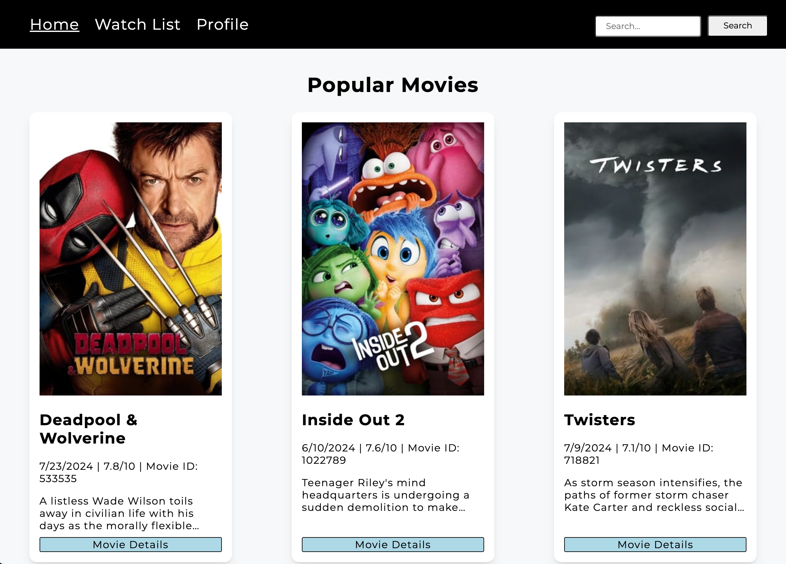

# React-WatchList
 React portfolio piece with NodeJs express API with  mongoDB database. Requires TVDB API key for movie data.
 place database_url in server/.env file

## TMDB API integration
add a TMDB API key in your account once you have one created and the app will use the TMDB api. The correct API key to get is "API Read Access Token"

### [Test site here](https://react-portfolio-theta-snowy.vercel.app/)

This site requires TMDB api key to function properly. To circumvent getting your own key, use this test account 
{user: test, password: test}